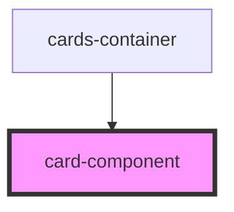

# my-component

<!-- Auto Generated Below -->

## Properties

| Property          | Attribute          | Description | Type     | Default     |
| ----------------- | ------------------ | ----------- | -------- | ----------- |
| `challengePoints` | `challenge-points` | The Points  | `number` | `undefined` |
| `challengeTitle`  | `challenge-title`  | The Title   | `string` | `undefined` |
| `day`             | `day`              | The day     | `number` | `undefined` |

## Dependencies

### Used by

 - [cards-container](../cards-container)

### Graph

----------------------------------------------

*Built with [StencilJS](https://stenciljs.com/)*
