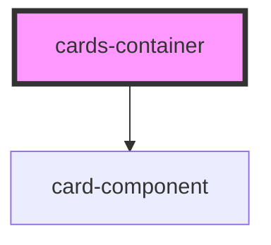

# cards-container

<!-- Auto Generated Below -->

## Properties

| Property   | Attribute | Description | Type                                   | Default                                                                                                     |
| ---------- | --------- | ----------- | -------------------------------------- | ----------------------------------------------------------------------------------------------------------- |
| `elements` | --        |             | `{ title: string; points: number; }[]` | `[     { title: "One", points: 2 },     { title: "Two", points: 1 },     { title: "Three", points: 1 }   ]` |

## Dependencies

### Depends on

- [card-component](../card-component)

### Graph

----------------------------------------------

*Built with [StencilJS](https://stenciljs.com/)*
