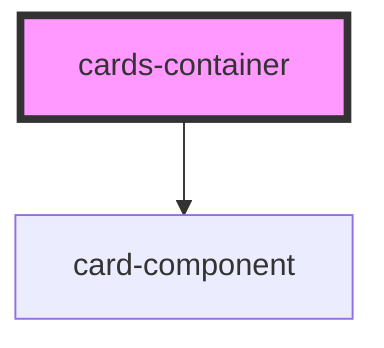

# cards-container

<!-- Auto Generated Below -->

## Properties

| Property   | Attribute | Description | Type                                   | Default                                                                                     |
| ---------- | --------- | ----------- | -------------------------------------- | ------------------------------------------------------------------------------------------- |
| `elements` | --        |             | `{ title: string; points: number; }[]` | `[{ title: 'one', points: 3 }, { title: 'two', points: 2 }, { title: 'three', points: 2 }]` |

## Dependencies

### Depends on

- [card-component](../card-component)

### Graph

----------------------------------------------

*Built with [StencilJS](https://stenciljs.com/)*
